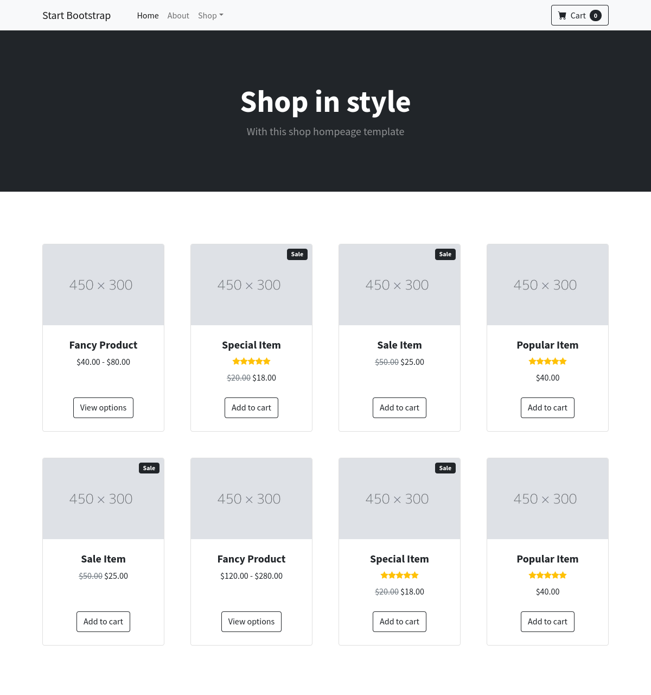

# My first bootstrap template


## Welcome! 

**To do this challenge, you need a basic understanding of HTML5 and CSS3.**

The challenge is to build out first e-commerce layout and get it looking as close to the design as possible.

You use Bootstrap v.4.6 to complete the challenge. 

So if you've got something you'd like to practice, feel free to give it a go.

## Requirements

- Fork this repo
- Clone this repo: git clone urlYourRepo

## Submission

- Upon completion, run the following commands:

  ```
  git add .
  git commit -m "done"
  git push origin main
  ```


## Instructions

**All your work will happen inside *starter_code* so first enter *starter_code*  and start coding**.

The designs are in JPG static format. All designs are in `/design` folder. You will find mobile, tablet and desktop version of the design.

Your task is to build the project

##Preview
;


### Built with

- Semantic HTML5 markup
- CSS custom properties
- Mobile first
- Bootstrap v.4.6

### Useful resources

- [Bootstrap v.4.6  Docs](https://getbootstrap.com/docs/4.6/getting-started/introduction/) 

Happy coding! ❤️
